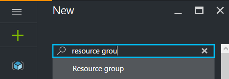
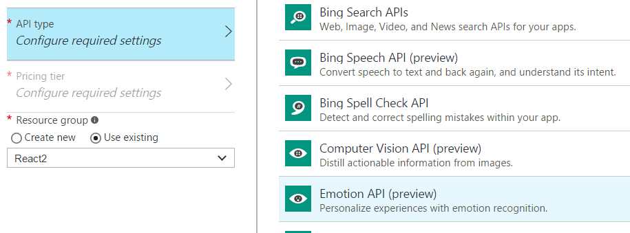
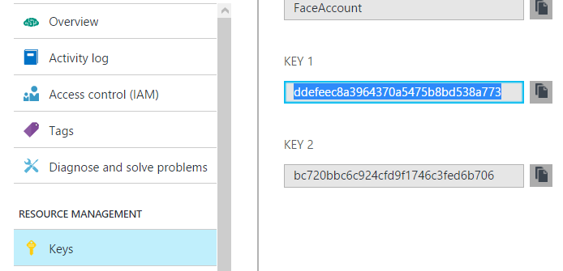
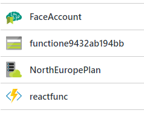
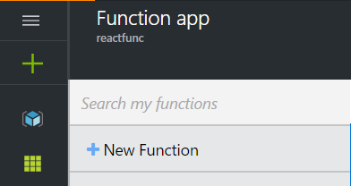
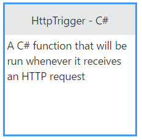
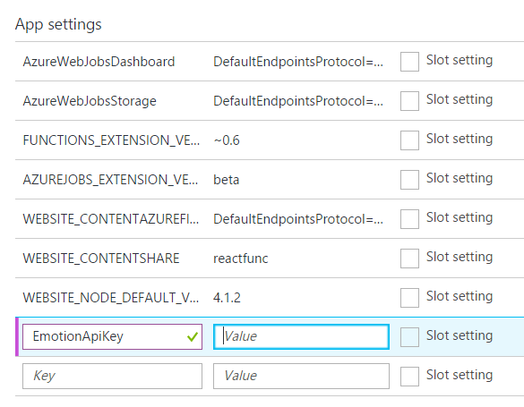
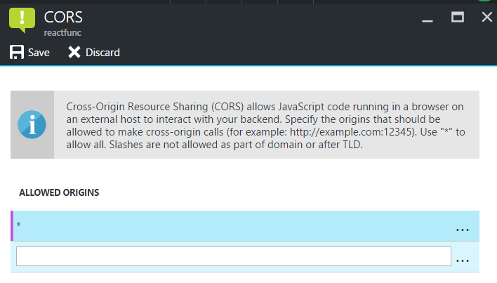

# Creating Emotion Detector Function

During this workshop you will learn how to create an emotion detection API based on Azure Funtions using Microsoft Cognitive Services. We will create a simple API based on Azure Functions which will receive an image, send it to Cognitive Services Emotions API and return back emotions the API has detected.

This lab includes the following sections:

* [Create Resources](#create-resources)
* [Create API](#create-api)
* [Configure API](#configure-api)

<a name="create-resources"></a>
## Create Resources

Using the **+ New** button you create all the Azure Resources that are available. You can either pick from categories, or search directly. The search will lead you to Azure Marketplace which contains different apps and services from Microsoft and partners.

We will start by creating a **Resource Group**:

1. Click **+ New**

2. Search for *Resource Group*

    

3. Pick the first result - **Resource group** from Microsoft

    

4. Click **Create**

5. Pick any name for the group, check **Pin to dashboard** and click **Create**

6. At dashboard click on your newly created Resource Group

Now you have the basic logical container for your app ready. Let's continue by adding some resources to it. We are going to need Cognitive Services and Functions.

### Cognitive Services API

1. In the **Overview** section click **Add** at the top

    

2. Search for *cognitive services*

3. Select **Cognitive Services APIs (preview)** from Microsoft

    

4. Click **Create**

5. Enter any account name

6. Select **API Type** as **Emotion API (preview)** 

    

7. In **Pricing tier** select **Free** 

8. Make sure the Resource group section has **Use existing** selected and that it shows the name of your recently created resource group

9. In **Legal terms** click **Review legal terms** and **I Agree**

10. Finally, click **Create** 

After the API is created it will be shown back in your Resource Group (you may have to open it again or click Refresh). Open its blade by clicking it and go to the **Keys** section. From there copy the value of **KEY 1**:

 

Save it somewhere (text file for instance) as we will need it later on.

### Function App

Next we will need to create the Function App. Go back to the Resource Group, click Add, search for Function App, choose Function App, click Create and then:

1. Enter **App name** which needs to be **globally unique** (as it's going to be a part of the URL)
2. Check again if the Resource group is correct
3. Keep **App Service plan** as **Consumption Plan**
4. Change **Location** to **<<Choose One>>** (to make it closer to us)
5. Keep Storage Account as is - it will create a new Storage which is needed for our app
6. Click **Create**

At this stage your Resource Group should contain everything that is needed for this workshop:

 

<a name="create-api"></a>
## Create the API

Now let's do something more interesting, let's code! We'll create the API, set it to wait for HTTP request containing an image, process it through Cognitive Services API and return emotion results as JSON.

1. Open the Function App you created in previous step

2. Click **+ New Function**

    

3. Select the **HttpTrigger - C#** template

    

4. Scroll down and name give your function a meaningful **name** (such as FaceProcessor...)

5. Set **Authorization level** to **Anonymous**, since we'll allow anyone to call the API

   > In production applications you should set the autorization level and require an API key to be present with the call.

6. Click **Create**

The app will get created and prepopulated with sample C# code. You can notice that it will get an `HttpRequestMessage` object which should contain the image we want to process.

```csharp
using System.Net;

public static async Task<HttpResponseMessage> Run(HttpRequestMessage req, TraceWriter log)
{
    log.Info($"C# HTTP trigger function processed a request. RequestUri={req.RequestUri}");
...
```

Now go to [this code file](https://github.com/kevingbb/App-Service-Day/blob/master/HOL/emotion-detector-function/Code/EmotionDetector.csx), copy the code and replace everything in the **Code** window. Then click **Save** and see in the Logs section if it compiled without errors.

The API will now run every time someone invokes it via HTTP request. But it's not ready yet! We are missing configuration.

<a name="configure-api"></a>
## Configure the API

You need to set up two things: the Emotion API key and CORS.

If you look closely at the code we just pasted, you will notice that we're setting a header called `Ocp-Apim-Subscription-Key`. It's value comes from an environmental variable called *EmotionApiKey*.

    client.DefaultRequestHeaders.Add("Ocp-Apim-Subscription-Key", Environment.GetEnvironmentVariable("EmotionApiKey"));
Let's set it up.

1. Leave the Develop section of your Function App and click **Function app settings** at the bottom.

    

2. Scroll down and select **Configure app settings** button next to Application settings

3. On the newly opened blade scroll down to the **App settings** section

4. Add new key called **EmotionApiKey** with value of KEY 1 for your Emotion API (Remember? We copied it earlier and saved it to a text file.)

    

5. Click **Save** at the top of the blade

### CORS Setup

Calls to Cognitive Services will now work. But we need to set up one more thing to make our API accessible from JavaScript - set up [CORS](https://en.wikipedia.org/wiki/Cross-origin_resource_sharing) headers.

1. Close the Application settings blade and go back to Function App settings

2. Click the **Configure CORS** button

3. Delete all prepopulated origins

    

4. Add new origin: *

    

5. Click **Save** 

<a name="consume-api"></a>
## Consume API

The API is now properly configured and ready to be called, let's test it out.

1. Open up your favourite API tool such as [Postman](https://www.getpostman.com/apps).

2. Find the Post URL and input it into the API tool:

	

    _Function App Url_

3. Find an image with a face on it and note the byte size.

4. Go back to your API Tool and do the following:

* Enter the Function App Url
* Change Http Request type to Post
* Add a "Content-Length" Header to the request using the file size in bytes found in the previous step (be sure to put the byte value in the header and not kilobytes)
* Add the selected image as Binary content to the Body of the Http Request

5. Test the API, the output should look something like the following:

```JSON
[
  {
    "faceRectangle": {
      "height": 40,
      "left": 162,
      "top": 141,
      "width": 40
    },
    "scores": {
      "anger": 0.00141347258,
      "contempt": 0.000047600086,
      "disgust": 0.000008298472,
      "fear": 0.000223334369,
      "happiness": 0.00016971177,
      "neutral": 0.977877855,
      "sadness": 0.00111991609,
      "surprise": 0.0191398021
    }
  }
]
...
```