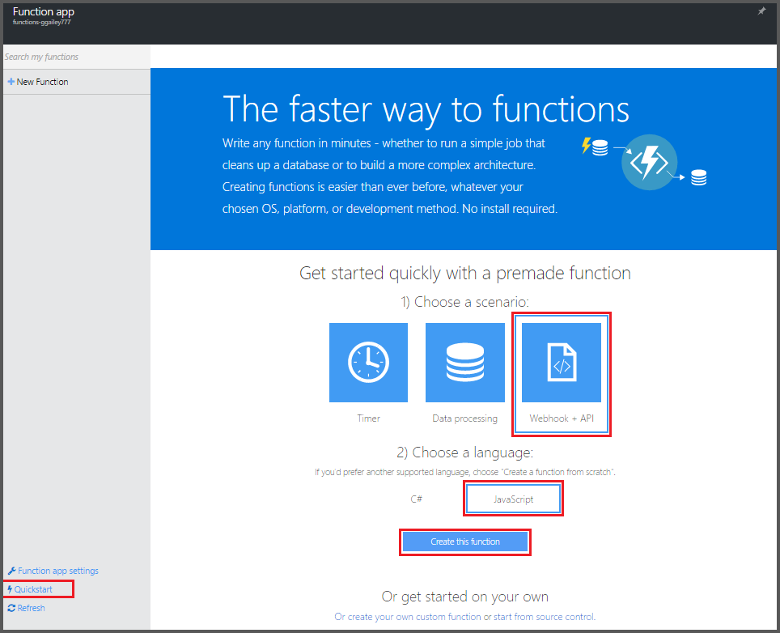
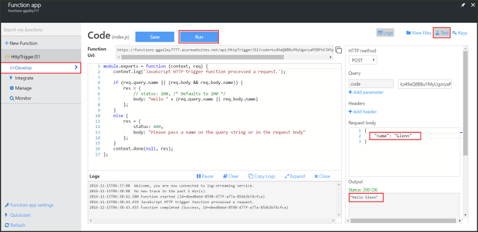
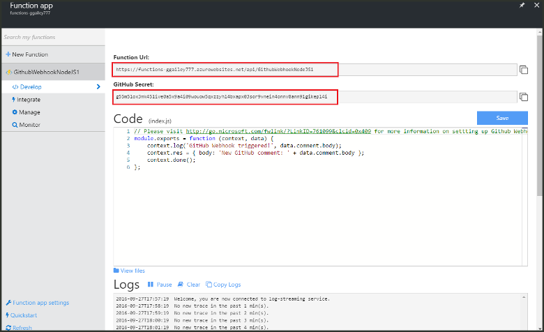
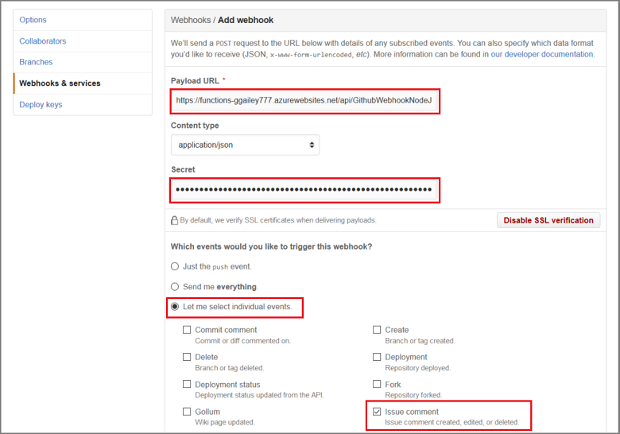
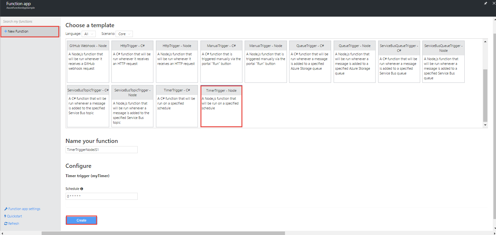
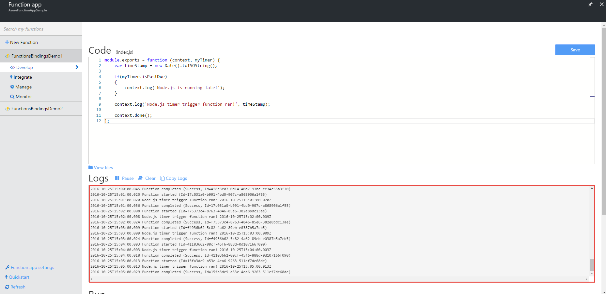
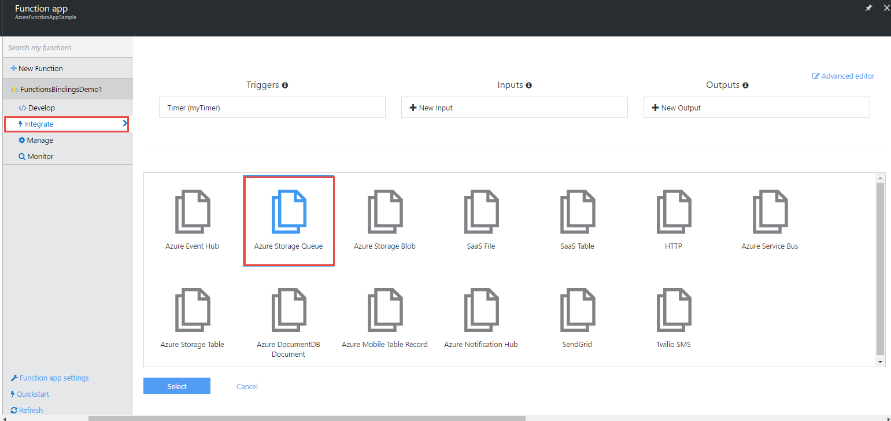
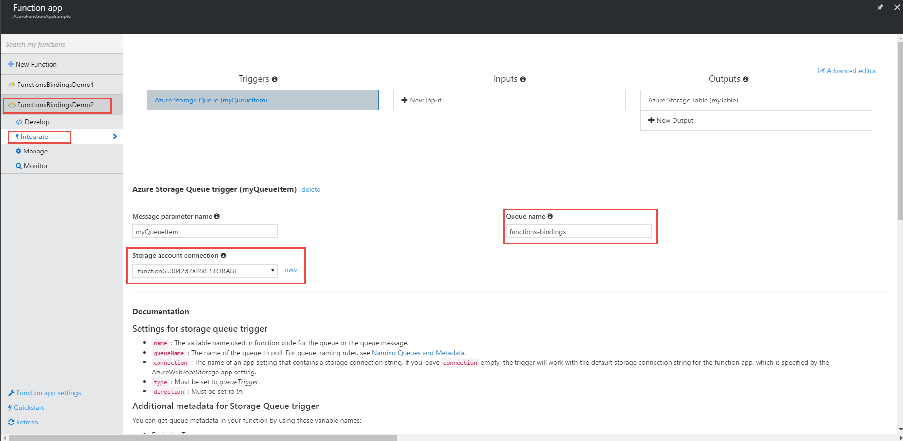

# Getting started with Azure Functions

This lab shows how to create an Azure Function, expose it as an API and consume it.

This lab includes the following sections:

* [Create a Function from the quickstart](#create-a-function-from-the-quickstart)
* [Configure Webhook Function](#configure-webhook-function)
* [Create Connected Function](#create-connected-functioin)
* [References](#references)

<a name="create-a-function-from-the-quickstart"></a>
## Create a function from the quickstart

A function app hosts the execution of your functions in Azure. Follow these steps to create a function app with the new function. The function app is created with a default configuration. For an example of how to explicitly create your function app, see [the other Azure Functions quickstart](https://docs.microsoft.com/en-us/azure/azure-functions/functions-create-first-azure-function-azure-portal) tutorial.

1. Go to the [Azure Functions portal](https://functions.azure.com/signin?correlationId=00000000-0000-0000-0000-000000000000) and sign-in with your Azure account.

2. Type a unique Name for your new function app or accept the generated one, select your preferred Region, then click Create + get started.

3. In the Quickstart tab, click WebHook + API and JavaScript, then click Create a function. A new predefined Node.js function is created.

	

    _Function App Quick Start_

	>**Note:** Make sure you enter "ContactManager". Code blocks that you will be copying later assume that the project name is ContactManager.

4. (Optional) At this point in the quickstart, you can choose to take a quick tour of Azure Functions features in the portal. After you have completed or skipped the tour, you can test your new function by using the HTTP trigger.

### Test the Function

Since the Azure Functions quickstarts contain functional code, you can immediately test your new function.

1. In the Develop tab, review the Code window and notice that this Node.js code expects an HTTP request with a name value passed either in the message body or in a query string. When the function runs, this value is returned in the response message.

2. Click Test to display the built-in HTTP test request pane for the function.

	

    _Function Develop Tab_
	
3. In the Request body text box, change the value of the name property to your name, and click Run. You see that execution is triggered by a test HTTP request, information is written to the streaming logs, and the "hello" response is displayed in the Output.

4. To trigger execution of the same function from another browser window or tab, copy the Function URL value from the Develop tab and paste it in a browser address bar. Append the query string value &name=yourname to the URL and press enter. The same information is written to the logs and the browser displays the "hello" response as before.

<a name="create-webhook-function"></a>
## Create Webhook Function

This topic shows you how to create a new Node.js function that is invoked by a GitHub webhook. The new function is created based on a pre-defined template in the Azure Functions portal. You can also watch a short video to see how these steps are performed in the portal.

1. Go to the [Azure Functions portal](https://functions.azure.com/signin?correlationId=00000000-0000-0000-0000-000000000000) and sign-in with your Azure account.

2. If you have an existing function app to use, select it from Your function apps then click Open. To create a new function app, type a unique Name for your new function app or accept the generated one, select your preferred Region, then click Create + get started.

3. In your function app, click + New Function > GitHub Webhook - Node > Create. This creates a function with a default name that is based on the specified template. 

	

    _Function Create Github Webhook_
	
4. In Develop, note the sample express.js function in the Code window. This function receives a GitHub request from an issue comment webhook, logs the issue text and sends a response to the webhook as New GitHub comment: <Your issue comment text>.

	

    _Function Webhook in Portal_

5. Copy the Function URL and GitHub Secret values. You will need these when you create the webhook in GitHub.

6. Scroll down to Run, note the predefined JSON body of an issue comment in the Request body, then click Run.

You can always test a new template-based function right in the Develop tab by supplying any expected body JSON data and clicking the Run button. In this case, the template has a predefined body for an issue comment.

### Configure Webhook Function

1. In GitHub, navigate to a repository that you own; this includes any repositories that you have forked.

2. Click Settings > Webhooks & services > Add webhook. 

	

    _Function Create Github Webhook 2_
	
3. Paste your function's URL and secret into Payload URL and Secret, then click Let me select individual events, select Issue comment and click Add webhook.

	

    _Function Create Github Webhook 3_

At this point, the GitHub webhook is configured to trigger your function when a new issue comment is added. Now, it's time to test it out.

### Test the Webhook Function

1. In your GitHub repo, open the Issues tab in a new browser window, click New Issue, type a title then click Submit new issue. You can also open an existing issue.

2. In the issue, type a comment and click Comment. At this point, you can go back to your new webhook in GitHub and under Recent Deliveries see that a webhook request was sent and that the body of response is New GitHub comment: <Your issue comment text>.
	
3. Back in the Functions portal, scroll down to the logs and see that the function has been triggered and the value New GitHub comment: <Your issue comment text> is written to the streaming logs.

<a name="create-connected-function"></a>
## Create Connected Function

In this section you will learn how to create an Azure Function that listens to messages on an Azure Queue and copies the messages to an Azure Blob.

### Create Input Queue Trigger Function

The goal of this function is to write a message to a queue every 10 seconds. To accomplish this, you must create the function and message queues, and add the code to write messages to the newly created queues.

1. Go to the Azure Portal and locate your Azure Function App.

2. Click New Function > TimerTrigger - Node. Name the function FunctionsBindingsDemo1

3. Enter a value of "0/10 * * * * *" for the Schedule. This value is in the form of a cron expression. This schedules the timer to run every 10 seconds.

4. Click the Create button to create the function. 

	

    _New Trigger Timer Function_
	
5. Verify that the function works by viewing activity in the log. You might have to click the Logs link in the upper right corner to display the log pane.

	

    _Functions Bindings View Log_

### Add Message Queue

1. Go to the Integrate tab.

2. Choose New Output > Azure Storage Queue > Select.

3. Enter myQueueItem in the Message parameter name text box.

4. Select a storage account, or click new to create a storage account if you do not have an existing one.

5. Enter functions-bindings in the Queue name text box. 

6. Click Save.

	

    _Functions Bindings Integrate Tab_

### Write To Message Queue

1. Return to the Develop tab, and add the following code to the function after the existing code:

```csharp
function myQueueItem() 
{
	return {
	  msg: "some message goes here",
	  time: "time goes here"
	}
}
...
```

2. Modify the existing function code to call the code added in Step 1. Insert the following code around line 9 of the function, after the if statement.

```csharp
var toBeQed = myQueueItem();
toBeQed.time = timeStamp;
context.bindings.myQueue = toBeQed;
...
```

This code creates a myQueueItem and sets its time property to the current timeStamp. It then adds the new queue item to the context's myQueue binding.

3. Click Save and Run.

4. Verify the code works by viewing the queue in Visual Studio.

1. Open Visual Studio, and go to View > Cloud Explorer.
1. Locate the storage account and functions-bindings queue you used when creating the myQueue queue. You should see rows of log data. You might need to sign into Azure through Visual Studio.

### Create Output Queue Trigger Function

The goal of this function is to write a message to a queue every 10 seconds. To accomplish this, you must create the function and message queues, and add the code to write messages to the newly created queues.

1. Click New Function > QueueTrigger - C#. Name the function FunctionsBindingsDemo2. Notice that you can mix languages in the same function app (Node and C# in this case).

2. Enter functions-bindings in the Queue name field.

3. Select a storage account to use or create a new one.

4. Click Create 

5. Verify the new function works by viewing both the function's log and Visual Studio for updates. The function's log shows that the function is running and items are dequeued. Since the function is bound to the functions-bindings output queue as an input trigger, refreshing the functions-bindings Queue in Visual Studio should reveal that the items are gone. They have been dequeued.

	

    _Functions Bindings2 Integrate Tab_

### Modify the queue item type from JSON to object:

1. Replace the code in FunctionsBindingsDemo2 with the following code:

```csharp
using System;

public static void Run(QItem myQueueItem, ICollector<TableItem> myTable, TraceWriter log)
{
	TableItem myItem = new TableItem
	{
	  PartitionKey = "key",
	  RowKey = Guid.NewGuid().ToString(),
	  Time = DateTime.Now.ToString("hh.mm.ss.ffffff"),
	  Msg = myQueueItem.Msg,
	  OriginalTime = myQueueItem.Time    
	};
	log.Verbose($"C# Queue trigger function processed: {myQueueItem.Msg} | {myQueueItem.Time}");
}

public class TableItem
{
	public string PartitionKey {get; set;}
	public string RowKey {get; set;}
	public string Time {get; set;}
	public string Msg {get; set;}
	public string OriginalTime {get; set;}
}

public class QItem
{
	public string Msg { get; set;}
	public string Time { get; set;}
}
...
```
	
	This code adds two classes, TableItem and QItem, that you use to read and write to queues. Additionally, the Run function has been modified to accept the QItem and TraceWriter parameter, instead of a string and a TraceWriter. 

2. Click the Save button.

3. Verify the code works by checking the log. Notice that Azure functions automatically serialize and deserialize the object for you, making it easy to access the queue in an object-oriented fashion to pass around data.

### Store Messages in Azure Table

Now that you have the queues working together, it's time to add in an Azure table for permanent storage of the queue data.

1. Go to the Integrate tab.

2. Create an Azure Storage Table for Output and name it myTable.

3. Answer functionsbindings to the question "To which table should the data be written?".

4. Change the PartitionKey setting from {project-id} to {partition}. 

5. Choose a storage account or create a new one.

6. Click Save.

7. Go to the Develop tab.

8. Create a TableItem class to represent an Azure table, and modify the Run function to accept the newly created TableItem object. Notice that you must use the PartitionKey and RowKey properties in order for it to work.

```csharp
public static void Run(QItem myQueueItem, ICollector<TableItem> myTable, TraceWriter log)
{    
	TableItem myItem = new TableItem
	{
	  PartitionKey = "key",
	  RowKey = Guid.NewGuid().ToString(),
	  Time = DateTime.Now.ToString("hh.mm.ss.ffffff"),
	  Msg = myQueueItem.Msg,
	  OriginalTime = myQueueItem.Time    
	};
	log.Verbose($"C# Queue trigger function processed: {myQueueItem.RowKey} | {myQueueItem.Msg} | {myQueueItem.Time}");
}

public class TableItem
{
	public string PartitionKey {get; set;}
	public string RowKey {get; set;}
	public string Time {get; set;}
	public string Msg {get; set;}
	public string OriginalTime {get; set;}
}
...
```

9. Click Save.

10. Verify that the code works by viewing the function's logs and in Visual Studio. To verify in Visual Studio, use the Cloud Explorer to navigate to the functionbindings Azure Table and verify there are rows in it.

<a name="references"></a>
## References

This quickstart demonstrates a simple execution of a basic HTTP-triggered function. To learn more about using Azure Functions in your apps, see the following topics:

* [Best Pracices for Azure Functions](https://docs.microsoft.com/en-us/azure/azure-functions/functions-best-practices)
* [Azure Functions Developer Reference](https://docs.microsoft.com/en-us/azure/azure-functions/functions-reference) Programmer reference for coding functions and defining triggers and bindings.
* [Testing Azure Functions](https://docs.microsoft.com/en-us/azure/azure-functions/functions-test-a-function) Describes various tools and techniques for testing your functions.
* [How to scale Azure Functions](https://docs.microsoft.com/en-us/azure/azure-functions/functions-scale) Discusses service plans available with Azure Functions, including the dynamic service plan, and how to choose the right plan.
* [What is Azure App Service?](https://docs.microsoft.com/en-us/azure/app-service/app-service-value-prop-what-is) Azure Functions uses the Azure App Service platform for core functionality like deployments, environment variables, and diagnostics.

## Summary

In this lab you have seen how to create an Azure Function, how to trigger Functions, how to test them and how to connect them to other Azure Services.